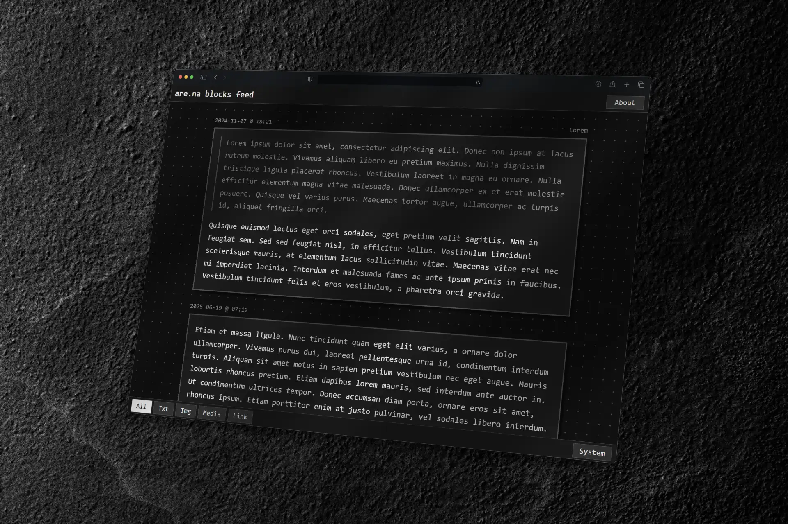

# Are.na Blocks Feed



A minimalist thoughts feed that displays blocks from your Are.na channel, heavily inspired by [thoughts.page](https://thoughts.page). 

I've been looking for a Twitter alternative that feels more personal, corporate-free, and aligned with the "miniweb" ethos. For a while [thoughts.page](https://thoughts.page) was the answer, but its lack of an edit feature was a dealbreaker for me. My search eventually led me to [are.na](https://are.na), and I loved its flexibility and structure.

I created Are.na Blocks Feed to get the best of both worlds: the simple, readable display of a thoughts feed with the flexible, editable backend of Are.na. Built to be easily served from Cloudflare Workers, this app is designed as a starter template for anyone who wants to build their own personal feed. Feel free to use it, change it, and make it your own. 

## Project Structure

```
├── src/
│   ├── worker.ts     # Main Cloudflare Worker script
│   └── types.d.ts    # TypeScript type declarations
├── index.html        # HTML template
├── style.css         # Styles with CSS custom properties
├── theme.js          # Theme toggle (and other) functionality
├── wrangler.toml     # Cloudflare Worker configuration
└── README.md
```

## Setup

### Installation

1. Clone the repository:
2. Install dependencies:
3. Configure your Are.na channel in `wrangler.toml`:

```toml
[vars]
CHANNEL_SLUG = "your-channel-slug"
```

4. (Optional) For private channels, set up your access token:

```bash
bunx wrangler secret put ARENA_ACCESS_TOKEN
# Enter your Are.na access token when prompted
```

### Deployment

Deploy to Cloudflare Workers:

```bash
bunx wrangler deploy
```

## Configuration

### Environment Variables

- `CHANNEL_SLUG`: Your Are.na channel slug (set in `wrangler.toml`)
- `ARENA_ACCESS_TOKEN`: Bearer token for private channels (optional, set as secret)

### Are.na Setup

1. Create a channel on [Are.na](https://are.na)
2. Note your channel slug from the URL: `are.na/your-username/channel-slug`
3. Add blocks (text, images, links, media) to your channel
4. For private channels, generate an access token at [dev.are.na](https://dev.are.na)

### Edit the HTML

- `index.html` is the main HTML file. Edit it to change the title, description, and other metadata. Currently it's hardcoded to display my title and description so you'll need to change that manually. 

### Customize the Styles

- `style.css` is the CSS file. Edit it to change the styles of the blocks.


## How It Works

1. **API Fetching**: The Worker fetches blocks from the Are.na API (`https://api.are.na/v2/channels/{slug}?per=100`)
2. **Caching**: API responses are cached at Cloudflare's edge for 5 minutes
3. **Rendering**: Blocks are rendered into HTML based on their type:
   - **Text**: Displayed as paragraphs with line breaks preserved
   - **Image**: Displayed as responsive images
   - **Media**: Embedded media content
   - **Link**: Clickable links with titles
4. **Static Assets**: CSS and JS are served inline with long cache headers
5. **Theme**: JavaScript handles system/light/dark theme switching with localStorage persistence

## Supported Block Types

- **Text**: Plain text thoughts and notes
- **Image**: Images with automatic responsive sizing
- **Media**: Embedded media content (videos, etc.)
- **Link**: External links with titles and descriptions
